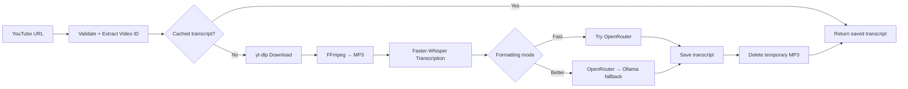

<div align="center">

# 🎓 LectureScribe AI

### Turn long YouTube lectures into clean, searchable text

**Faster-Whisper · FastAPI · FFmpeg · OpenRouter · Ollama · Background jobs · Persistent transcript cache**

[](https://www.python.org/)
[](https://fastapi.tiangolo.com/)
[](https://github.com/SYSTRAN/faster-whisper)
[](https://ffmpeg.org/)
[](#ai-cleaning)

🌐 **Live project:** [lecturescribe.app](https://lecturescribe.app)

</div>

---

## The idea

Students often have hours of recorded lectures but no practical way to search, review, or reuse what was said. LectureScribe AI converts a YouTube lecture into a readable transcript and keeps the result available for future requests.

The system is designed as a real processing pipeline rather than a one-shot script: it validates URLs, queues work, downloads audio, transcribes with Faster-Whisper, optionally cleans the result with an LLM, tracks live progress, caches outputs, and exposes everything through a browser interface.

---

## What makes it interesting

| Capability | Implementation |
| --- | --- |
| 🎙️ **Accurate transcription** | Faster-Whisper `large-v3` on CUDA with original-language handling |
| ⚡ **Two processing modes** | Fast Output for speed, Better Formatting for higher-quality cleaned text |
| 🤖 **Cloud + local AI** | OpenRouter for formatting with Ollama fallback in Better Formatting mode |
| 📥 **YouTube ingestion** | URL validation + `yt-dlp` + FFmpeg audio conversion |
| 🧵 **Background processing** | FastAPI job creation, queueing, stage tracking, and live progress |
| ♻️ **Persistent cache** | Video-ID based reuse across watch/short/playlist URL variants |
| 🧹 **Automatic cleanup** | Temporary MP3 files are deleted after successful processing |
| 🕘 **Job history** | Persistent job metadata and a Previous Jobs interface |
| 🌐 **Browser experience** | End-user web interface instead of CLI-only execution |

---

## Pipeline



---

## Processing modes

### ⚡ Fast Output

Best when the priority is getting text quickly.

- Reuses cached output when available.
- Runs Faster-Whisper for new lectures.
- Attempts OpenRouter formatting.
- If cloud formatting is unavailable, returns the raw Whisper transcript immediately.

### ✨ Better Formatting

Best when readability matters more than speed.

- Runs the same transcription pipeline.
- Tries OpenRouter first.
- Falls back to local Ollama when cloud formatting is unavailable.
- Saves the cleaned result for future cache hits.

---

## AI cleaning

Lecture transcripts often contain repeated words, filler, broken punctuation, and technical terms mixed across Arabic and English. The cleaning stage improves readability without replacing the original speech with invented content.

The project supports:

- OpenRouter-compatible cloud models
- Local Ollama fallback
- Chunked transcript processing
- Duplicate cleanup
- Preservation of Arabic script and English technical terminology

---

## Background job model

The web API exposes each lecture as a job with observable state:

```text
status
stage
stage_label
progress_percent
current_step / total_steps
estimated_stage_seconds
chunk_index / chunk_total
```

Only one heavy transcription job is executed at a time using `ThreadPoolExecutor(max_workers=1)`, while additional jobs wait in the queue. This avoids uncontrolled GPU contention on the host machine.

---

## Cache strategy

The cache uses the 11-character YouTube video ID instead of the raw URL, so different URL forms can resolve to the same lecture.

Lookup order:

1. Valid entry in `transcript_cache.json`
2. Existing cleaned transcript
3. Existing raw transcript
4. Full download + transcription pipeline

This turns repeated requests from a compute-heavy GPU task into an immediate file lookup.

---

## Tech stack

**Backend**  
Python · FastAPI · background jobs · persistent JSON metadata

**Speech & media**  
Faster-Whisper · CUDA · FFmpeg · yt-dlp

**AI formatting**  
OpenRouter · Ollama · chunked transcript cleaning

**Frontend**  
Browser-based submission · progress UI · job history · transcript viewer

**Delivery**  
Cloudflare Tunnel · GitHub · environment-based secrets

---

## Project structure

```text
api.py                       # FastAPI server, frontend routes and jobs
MainCode_FasterWhisper.py    # Transcription + cache + cleaning pipeline
url_to_mp3.py                # URL validation, yt-dlp and FFmpeg conversion
clean_with_Llama.py          # OpenRouter/Ollama cleaning logic
front/                       # Web interface and Previous Jobs UI
OutputForWhisper/            # Raw transcripts
OutputForOllama/             # Cleaned transcripts
```

---

## Run locally

### Requirements

- Python 3.10+
- NVIDIA CUDA GPU for the current configuration
- FFmpeg
- Faster-Whisper `large-v3`
- Ollama for local fallback
- OpenRouter API key for cloud formatting

```bash
pip install -r requirements.txt
```

Start Ollama when using the local fallback:

```bash
ollama serve
```

Start the app:

```bash
python api.py
```

Then open:

```text
http://127.0.0.1:8000
```

> Do not use Uvicorn `--reload` while jobs are running; generated job/cache files can trigger a restart during processing.

---

## API examples

Create a job:

```bash
curl -X POST http://127.0.0.1:8000/jobs \
  -H "Content-Type: application/json" \
  -d '{"youtube_url":"https://www.youtube.com/watch?v=VIDEO_ID","clean":true}'
```

Useful endpoints:

```text
GET /health
GET /jobs
GET /jobs/{job_id}
GET /jobs/{job_id}/transcript
GET /jobs/{job_id}/transcript?kind=raw
```

---

## Engineering lessons

Building LectureScribe AI required solving more than speech-to-text. The project combines:

- long-running background work,
- GPU-bound processing,
- media conversion,
- cloud/local model fallback,
- caching and idempotency,
- progress reporting,
- cleanup of temporary assets,
- and a usable web experience around the pipeline.

That combination is what turns a transcription script into an actual application.

---

<div align="center">

### Graduation Project — LectureScribe AI

Built by **GraduationGroup101**

[Live Website](https://lecturescribe.app) · [Repository](https://github.com/GraduationGroup101/LectureScribe-AI)

</div>
