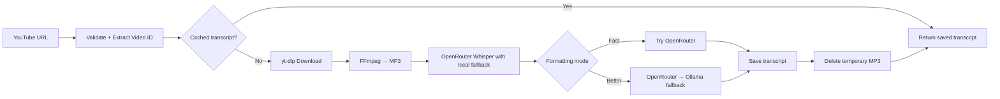

<div align="center">

# 🎓 LectureScribe AI

### Turn long YouTube lectures into clean, searchable text

**Faster-Whisper · FastAPI · FFmpeg · OpenRouter · Ollama · Background jobs · Persistent transcript cache**

[](https://www.python.org/)
[](https://fastapi.tiangolo.com/)
[](https://github.com/SYSTRAN/faster-whisper)
[](https://ffmpeg.org/)
[](#ai-cleaning)

🌐 **Live project:** [lecturescribe.app](https://lecturescribe.app)

</div>

---

## The idea

Students often have hours of recorded lectures but no practical way to search, review, or reuse what was said. LectureScribe AI converts a YouTube lecture into a readable transcript and keeps the result available for future requests.

The system is designed as a real processing pipeline rather than a one-shot script: it validates URLs, queues work, downloads audio, transcribes with Faster-Whisper, optionally cleans the result with an LLM, tracks live progress, caches outputs, and exposes everything through a browser interface.

---

## What makes it interesting

| Capability | Implementation |
| --- | --- |
| 🎙️ **Accurate transcription** | OpenRouter Whisper `large-v3` by default, with local Faster-Whisper fallback |
| ⚡ **Two processing modes** | Fast Output for speed, Better Formatting for higher-quality cleaned text |
| 🤖 **Cloud + local AI** | OpenRouter for formatting with Ollama fallback in Better Formatting mode |
| 📥 **YouTube ingestion** | URL validation + `yt-dlp` + FFmpeg audio conversion |
| 🧵 **Background processing** | FastAPI job creation, queueing, stage tracking, and live progress |
| ♻️ **Persistent cache** | Video-ID based reuse across watch/short/playlist URL variants |
| 🧹 **Automatic cleanup** | Temporary MP3 files are deleted after successful processing |
| 🕘 **Job history** | Persistent job metadata and a Previous Jobs interface |
| 🌐 **Browser experience** | End-user web interface instead of CLI-only execution |

---

## Pipeline


```mermaid
flowchart LR
    A[YouTube URL] --> B[Validate + Extract Video ID]
    B --> C{Cached transcript?}
    C -- Yes --> H[Return saved transcript]
    C -- No --> D[yt-dlp Download]
    D --> E[FFmpeg → MP3]
    E --> F[OpenRouter Whisper with local fallback]
    F --> G{Formatting mode}
    G -- Fast --> I[Try OpenRouter]
    G -- Better --> J[OpenRouter → Ollama fallback]
    I --> K[Save transcript]
    J --> K
    K --> L[Delete temporary MP3]
    L --> H
```

---

## Processing modes

### ⚡ Fast Output

Best when the priority is getting text quickly.

- Reuses cached output when available.
- Transcribes new lectures with OpenRouter Whisper, falling back to local Faster-Whisper if unavailable.
- Attempts OpenRouter formatting.
- If cloud formatting is unavailable, returns the raw Whisper transcript immediately.

### ✨ Better Formatting

Best when readability matters more than speed.

- Runs the same transcription pipeline.
- Tries OpenRouter first.
- Falls back to local Ollama when cloud formatting is unavailable.
- Saves the cleaned result for future cache hits.

---

## AI cleaning

Lecture transcripts often contain repeated words, filler, broken punctuation, and technical terms mixed across Arabic and English. The cleaning stage improves readability without replacing the original speech with invented content.

The project supports:

- OpenRouter-compatible cloud models
- Local Ollama fallback
- Chunked transcript processing
- Duplicate cleanup
- Preservation of Arabic script and English technical terminology

---

## Background job model

The web API exposes each lecture as a job with observable state:

```text
status
stage
stage_label
progress_percent
current_step / total_steps
estimated_stage_seconds
chunk_index / chunk_total
```

Only one heavy transcription job is executed at a time using `ThreadPoolExecutor(max_workers=1)`, while additional jobs wait in the queue. This avoids uncontrolled GPU contention on the host machine.

---

## Cache strategy

The cache uses the 11-character YouTube video ID instead of the raw URL, so different URL forms can resolve to the same lecture.

Lookup order:

1. Valid entry in `transcript_cache.json`
2. Existing cleaned transcript
3. Existing raw transcript
4. Full download + transcription pipeline

This turns repeated requests from a compute-heavy GPU task into an immediate file lookup.

---

## Tech stack

**Backend**  
Python · FastAPI · background jobs · persistent JSON metadata

**Speech & media**  
Faster-Whisper · CUDA · FFmpeg · yt-dlp

**AI formatting**  
OpenRouter · Ollama · chunked transcript cleaning

**Frontend**  
Browser-based submission · progress UI · job history · transcript viewer

**Delivery**  
Cloudflare Tunnel · GitHub · environment-based secrets

---

## Project structure

```text
api.py                       # FastAPI server, frontend routes and jobs
MainCode_FasterWhisper.py    # Transcription + cache + cleaning pipeline
url_to_mp3.py                # URL validation, yt-dlp and FFmpeg conversion
clean_with_Llama.py          # OpenRouter/Ollama cleaning logic
front/                       # Web interface and Previous Jobs UI
OutputForWhisper/            # Raw transcripts
OutputForOllama/             # Cleaned transcripts
```

---

## Run locally

### Requirements

- Python 3.10+
- FFmpeg
- OpenRouter API key with transcription credits
- Faster-Whisper `large-v3` for local fallback (CUDA or CPU)
- Ollama for local fallback
- OpenRouter API key for cloud formatting (the same key)

```bash
pip install -r requirements.txt
```

Set your key in the ignored `.env` file; `.env.example` lists the supported settings:

```dotenv
OPENROUTER_API_KEY=your-key
WHISPER_BACKEND=openrouter
OPENROUTER_TRANSCRIPTION_MODEL=openai/whisper-large-v3
OPENROUTER_TRANSCRIPTION_TIMEOUT_SECONDS=120
OPENROUTER_AUDIO_CHUNK_SECONDS=300
WHISPER_LOCAL_FALLBACK=true
OLLAMA_LOCAL_FALLBACK=true
```

Both modes prefer cloud transcription and save original-language text in
`OutputForWhisper/`. Long audio is converted into temporary mono five-minute MP3
chunks, sent sequentially, and removed afterwards. A cloud failure (including missing
credentials, insufficient credits, timeout, or an empty response) retries the original
audio with local Faster-Whisper. Partial cloud transcripts are never saved as a result.
Job metadata includes `transcription_provider` and `transcription_info`; a local
fallback records its `cloud_error` there. Existing cache hits still skip transcription.

For local fallback, `WHISPER_DEVICE=auto` selects CUDA when available, otherwise CPU;
`WHISPER_COMPUTE_TYPE=auto` selects `int8_float16` on CUDA or `int8` on CPU. Use
`WHISPER_MODEL_SIZE` or `WHISPER_MODEL_PATH` to override the local model.
Set `WHISPER_BACKEND=local` to run only locally. Set `WHISPER_LOCAL_FALLBACK=false`
on cloud servers too small to run a local model.

Cloud transcription can run without importing the local Whisper/CUDA libraries.
It still requires FFmpeg for audio download/conversion and chunking.

### Render preview

The root `Dockerfile` installs FFmpeg, Node.js, and the cloud-only dependencies in
`requirements-render.txt`. Create a Docker web service from this repository on the
`main` branch, using the Free plan and `/health` as the health check. Set
`OPENROUTER_API_KEY` as a secret in Render; do not upload `.env`. The container
disables local Faster-Whisper and Ollama fallbacks, so OpenRouter needs sufficient
transcription and formatting credits. If cloud formatting fails, the raw transcript
is returned; if cloud transcription fails, the job fails.

Render Free spins down after 15 idle minutes. Its filesystem is ephemeral, so
`jobs.json`, `transcript_cache.json`, and generated transcripts can disappear after
a restart or redeploy. It is suitable for a short demonstration, not durable job
history or guaranteed always-on access. Use external storage and an appropriate
paid service before relying on it for long-running jobs. The public service can
consume OpenRouter credits, and downloading YouTube videos from a datacenter IP
may be blocked. See [Render Free limitations](https://render.com/docs/free).

Start Ollama when using the local fallback:

```bash
ollama serve
```

Start the app:

```bash
python api.py
```

Then open:

```text
http://127.0.0.1:8000
```

> Do not use Uvicorn `--reload` while jobs are running; generated job/cache files can trigger a restart during processing.

---

## API examples

For the Oracle VM deployment kit, SSH upload command, persistent state layout,
and Cloudflare domain setup, see [Oracle deployment](deploy/oracle/README.md).

Create a job:

```bash
curl -X POST http://127.0.0.1:8000/jobs \
  -H "Content-Type: application/json" \
  -d '{"youtube_url":"https://www.youtube.com/watch?v=VIDEO_ID","clean":true}'
```

Useful endpoints:

```text
GET /health
GET /jobs
GET /jobs/{job_id}
GET /jobs/{job_id}/transcript
GET /jobs/{job_id}/transcript?kind=raw
```

---

## Engineering lessons

Building LectureScribe AI required solving more than speech-to-text. The project combines:

- long-running background work,
- GPU-bound processing,
- media conversion,
- cloud/local model fallback,
- caching and idempotency,
- progress reporting,
- cleanup of temporary assets,
- and a usable web experience around the pipeline.

That combination is what turns a transcription script into an actual application.

---

<div align="center">

### Graduation Project — LectureScribe AI

Built by **GraduationGroup101**

[Live Website](https://lecturescribe.app) · [Repository](https://github.com/GraduationGroup101/LectureScribe-AI)

</div>
